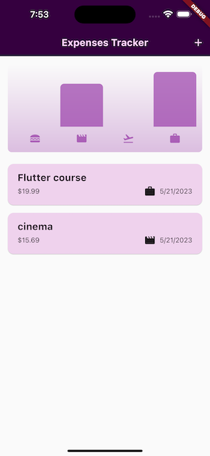

# [Giangbb Studio]

# Flutter A-Z

A series of flutter projects from easy to advanced

  
  
  
  
  
  

#

## project 01 - Rolling dice App

- Getting Started With Flutter & Dart

## project 02 - Quiz App

- Getting Started with Widgets

## project 03 - Expense App

- Working with Widgets & Modals
- Setting & Using a Color Scheme
- Building Responsive & Adaptive User Interfaces

## project 04 - Meals App

- Building Multi screen app & Navigating between Screens
- Managing App-wide States
- Implement animation

## project 05 - Shopping List App

- Handle User Input & Working with Forms
- Working with HTTP request
- Working with FutureBuilder Widget

## project 06 - Favorite Places App

- Managing App-wide States
- Using device's features
- Using Google maps APIs
- Using SQL Database

## project 07 - Chat App

- Building Chat App Based On Firebase
