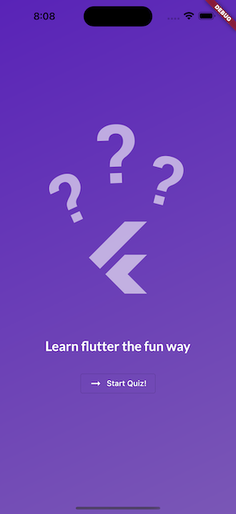
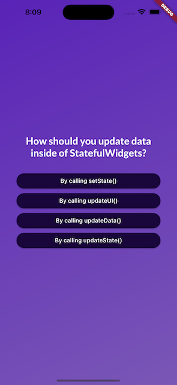
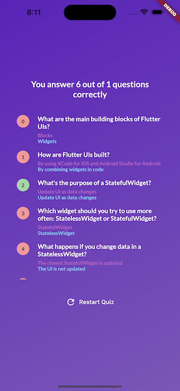

# project 02 - Quiz App

  
  
  

## Getting Started with Widgets

- Dart: Map, List, loops, conditions, function
- Flutter's (Stateful) Widget Lifecycle
- Stateless vs Stateful Widget
- Alignment, Margin & Padding
- Adding Icons to Buttons
- Adding Transparency to Widgets
- Working with Content Scrollable with SingleChildScrollView
