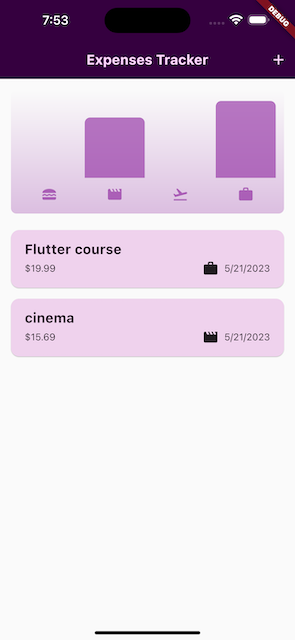
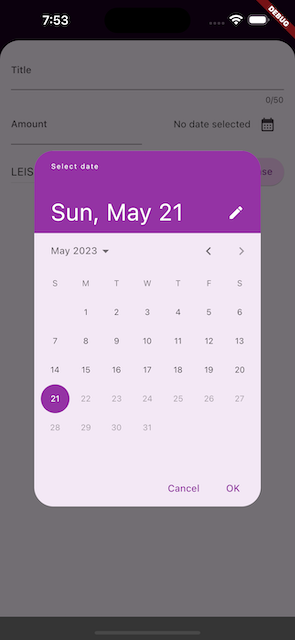
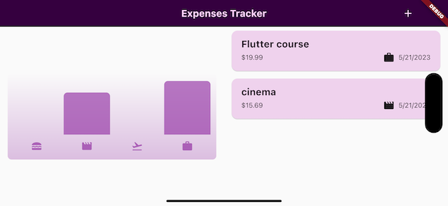

# project 03 - Expense App

  
  
  

#

## Working with Widgets & Modals

- Working with enum
- Working with ListView, List Item builder
- Working with List Item Dismissible
- Working with AppBar
- Working with Modal Sheet
- Getting User Input, working with TextEditingController
- Working with Date Picker
- Working with Dropdown Button
- Showing & Managing "Snackbars"

## Setting & Using a Color Scheme

- Setting Text Themes
- Using Theme Data in Widgets
- Adding Dark Mode

## Building Responsive & Adaptive User Interfaces

- Locking the Device Orientiation
- Updating the UI based on the Available Space
- Working with "Safe Areas"
- Using the LayoutBuilder Widget
- Building Responsive & Adaptive Widgets
