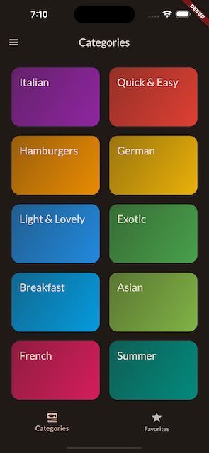
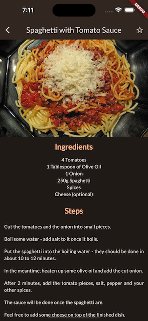

# project 04 - Meals App

  
  
  

#

## Building Multi screen app & Navigating between Screens

- Working with GridView Widget
- Building Screens
- Making any Widget Tappable with InkWell
- Adding Cross-Screen Navigation
- Passing Data to the Target Screen
- Working with Stack Widget
- Working with Tab-based Navigation
- Working with Side Drawer

## Managing App-wide States

- Working with Riverpod
- Working with Providers

## Implement animation

- Implement Explicit (via Animation Controller) & Implicit Animations
- Implement multi-Screen Transitions
