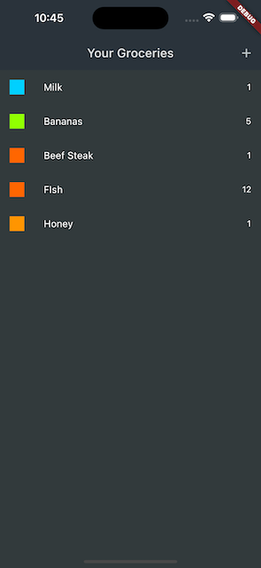
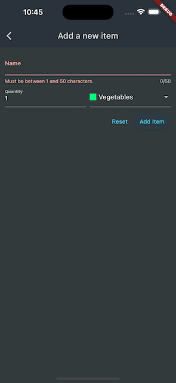

# [Giangbb Studio]

# project 05 - Shopping List App

  
  
  

#

## Handle User Input & Working with Forms

- Working with Form Widget
- Working with TextFormField Widget
- Working with Form-aware Dropdown Button Widget
- Working with Form Validation
- Getting Form Access via Global Key

## Working with HTTP request

- Working with HTTP package
- Fetching and transforming json Data
- Error handling