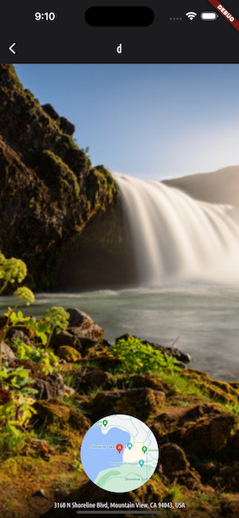

# [Giangbb Studio]

# project 06 - Favorite Places App

  
  
  
  

#

## Managing App-wide States

- Working with Riverpod
- Working with Providers

## Using device's features

- Picking Image from device's gallery
- Picking Image from device's camera
- Working with Application's Directory: save/get files

## Using Google maps APIs

- Using Google's Geocoding API
- Displaying a Location Preview Map Snapshot via Google
- Working with Google maps: handling tap, markers, ...

## Using SQL Database

- Working with SQLLite db
- Using a FutureBuilder for Loading Data
