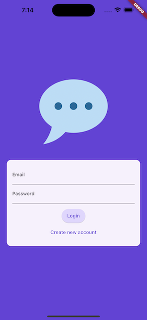
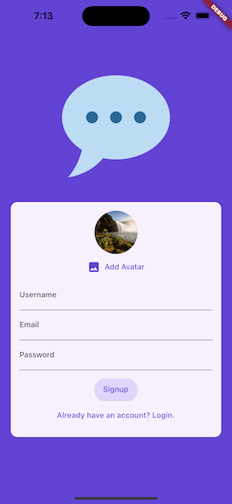
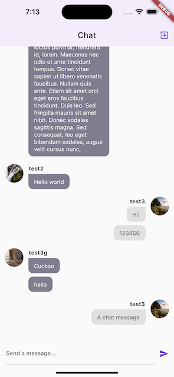

# [Giangbb Studio]

# project 07 - Chat App

  
  
  

#

## Building Chat App Based On Firebase

- Working with Firebase Auth
- Working with Firebase Storage
- Working with Firebase FireStore
- Working with Firebase Messaging

## Using device's features

- Picking Image from device's gallery
- Picking Image from device's camera
